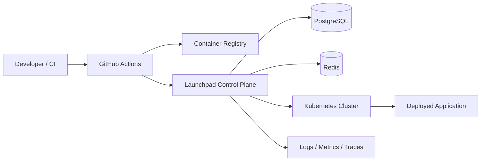

# Launchpad

Launchpad is a Spring Boot deployment control plane for small engineering teams. It standardizes how containerized applications are released to Kubernetes, tracks deployment history, exposes runtime status and logs, and keeps rollback auditable.

## What It Does

- Accepts CI-driven deployment requests with immutable image references.
- Deploys workloads to Kubernetes through a standardized Helm chart.
- Stores projects, environments, secrets, deploy tokens, and audit events in PostgreSQL.
- Reconciles rollout state and surfaces runtime health, logs, and rollback actions.
- Emits operational metrics and logs for the control plane itself.

## Why It Exists

Most small teams start with shell scripts, ad hoc `kubectl` usage, or Docker Compose. That works until deploys become frequent enough that history, rollback, access control, and observability matter. Launchpad is a portfolio-grade platform project built around those production concerns.

## Architecture

Launchpad is implemented as a modular monolith in a single Spring Boot service named `control-plane`.



The control plane owns auth, RBAC, deployment orchestration, rollout reconciliation, audit history, and runtime APIs. Kubernetes runs the user workloads. PostgreSQL is the source of truth for all Launchpad state.

## Key Capabilities

- Authentication and team-based authorization
- Project and environment management
- Encrypted secret storage
- Deploy token issuance for CI pipelines
- Idempotent deployment creation
- Helm-based Kubernetes deployment
- Rollback to the most recent healthy release
- Runtime status, logs, and audit history
- Metrics and observability for the platform itself

## Repository Layout

```text
launchpad/
  README.md
  CONTRIBUTING.md
  SECURITY.md
  CHANGELOG.md
  docs/
    api/
    architecture/
    operations/
    plans/
    runbooks/
  infra/           # To be implemented
  services/        # To be implemented
    control-plane/
```

## Quick Start

The project is designed to run locally with Docker, PostgreSQL, Redis, and a local Kubernetes cluster.

> **Note:** The implementation is currently in progress. The commands below represent the intended workflow once development is complete.

```bash
docker compose -f infra/local/docker-compose.yml up -d
./mvnw -f services/control-plane/pom.xml test
./mvnw -f services/control-plane/pom.xml spring-boot:run -Dspring-boot.run.profiles=local
```

Once running, verify the control plane:

- `GET http://localhost:8080/actuator/health`
- `GET http://localhost:8080/api/v1/projects/{projectId}/runtime`
- `GET http://localhost:8080/api/v1/projects/{projectId}/logs`

## Documentation

- [Documentation Index](docs/README.md)
- [System Context](docs/architecture/system-context.md)
- [Deployment Flow](docs/architecture/deployment-flow.md)
- [Runtime Components](docs/architecture/runtime-components.md)
- [API Overview](docs/api/overview.md)
- [Local Development Runbook](docs/runbooks/local-development.md)
- [Implementation Plan](docs/plans/2026-04-01-launchpad.md)
- [Technical Design](docs/plans/2026-04-01-launchpad-design.md)

## Production Notes

- Secrets are encrypted before persistence.
- Deploy requests require an idempotency key.
- Rollback creates a new audited deployment record instead of mutating history in place.
- The platform trusts Kubernetes reconciliation, not client-reported runtime state.

## Contributing

Keep changes small and production-oriented. Prefer explicit contracts, tests, and runbooks over broad abstractions.

See also:

- [Contributing Guide](CONTRIBUTING.md)
- [Security Policy](SECURITY.md)
