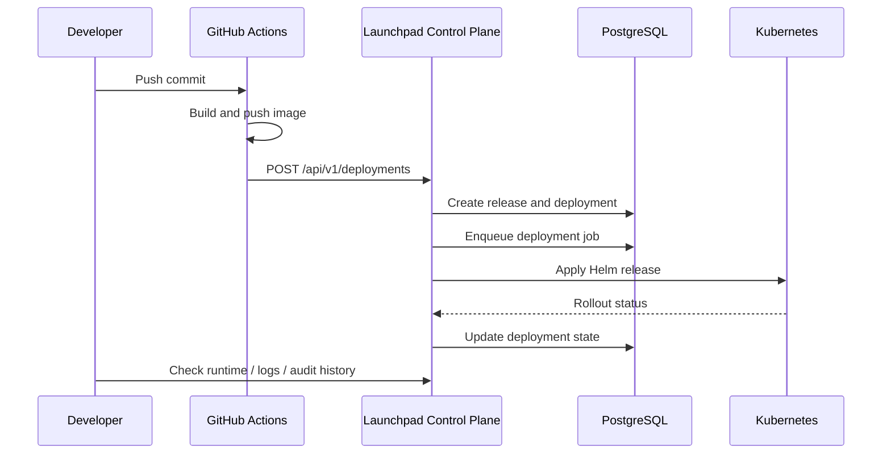

# Deployment Flow

## Overview

This document describes the normal release path for Launchpad. The flow is designed around traceability, idempotency, and rollback safety.

## End-to-End Flow

## Step 1: Build and Publish

GitHub Actions builds the application image and pushes it to a trusted registry such as GHCR. The deploy workflow must use an immutable reference, such as a commit SHA tag or digest.

## Step 2: Request Deployment

The workflow calls `POST /api/v1/deployments` with:

- project id
- environment id
- image reference
- git SHA
- trigger source
- `Idempotency-Key`

Launchpad validates the caller, checks policy, and stores a `release` plus a `deployment` record.

## Step 3: Queue the Job

Deployment work is written to a database-backed job table. This keeps the first release simple and avoids introducing a separate broker before it is justified.

## Step 4: Apply to Kubernetes

The worker renders Helm values from project and environment configuration, then runs `helm upgrade --install` against the target namespace.

## Step 5: Reconcile Runtime State

Launchpad polls Kubernetes for rollout progress and records whether the deployment is:

- `PENDING`
- `APPLYING`
- `HEALTH_CHECKING`
- `HEALTHY`
- `FAILED`
- `ROLLED_BACK`

## Step 6: Rollback if Needed

Rollback creates a new deployment that points to the last healthy release. The history remains explicit and auditable.

## Failure Handling

- Duplicate deployment requests with the same idempotency key must not create duplicate releases.
- Failed rollouts must persist a failure reason.
- Worker retries use bounded backoff and lock expiry.
- Client-reported state is never treated as authoritative.

## What Recruiters Should Notice

This flow demonstrates real production concerns:

- CI-driven release automation
- idempotent write APIs
- queueing without over-engineering
- Kubernetes orchestration
- rollout reconciliation
- auditability and rollback
