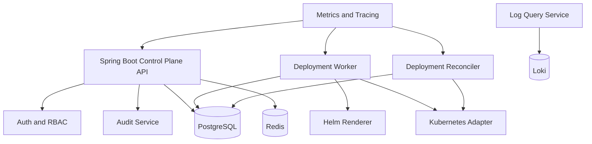

# Runtime Components

## Overview

Launchpad runtime is split into a small number of explicit components so the system stays understandable and testable.

## Component Map

## Spring Boot Control Plane

The control plane is the only public-facing application in the platform. It exposes auth, project management, deployment APIs, rollback, logs, runtime status, and audit views.

### Responsibilities

- Validate requests
- Enforce authorization
- Persist all domain state
- Dispatch deployment jobs
- Expose operational APIs

## Deployment Worker

The worker claims pending deployment jobs from PostgreSQL, renders Helm values, and applies releases to Kubernetes.

### Responsibilities

- Lock one job at a time
- Render environment-specific configuration
- Apply the release
- Capture execution outcome
- Persist failure metadata when needed

## Deployment Reconciler

The reconciler polls Kubernetes for rollout status and updates the deployment lifecycle state in PostgreSQL.

### Responsibilities

- Detect healthy releases
- Detect failed rollouts
- Update runtime snapshots
- Keep deployment state authoritative

## Kubernetes Adapter

The Kubernetes adapter isolates all cluster calls. It keeps direct API client usage out of controllers and services.

### Responsibilities

- Namespace management
- Helm release execution
- Rollout inspection
- Pod and service observation

## Helm Renderer

The Helm renderer maps Launchpad project and environment settings into deployment values.

### Responsibilities

- Image reference rendering
- Port and probe configuration
- Secret wiring
- Resource and ingress settings

## Audit Service

The audit service writes an append-only trail of sensitive operations.

### Events

- Login success and failure
- Project and environment changes
- Secret updates
- Deploy token rotation
- Deployment creation
- Rollback

## Log Query Service

Launchpad reads recent application logs through a controlled query service. Queries must remain safe and constrained by server-side filters.

### Guardrails

- No raw backend query passthrough
- Scope reads to a project or deployment
- Redact sensitive values when necessary

## Data Stores

### PostgreSQL

The source of truth for:

- users
- teams
- projects
- environments
- secrets
- releases
- deployments
- deployment jobs
- audit events

### Redis

Used only for transient concerns:

- rate limiting
- short-lived cache entries
- request deduplication support

## Observability

The platform must expose:

- HTTP request metrics
- deployment duration and success metrics
- queue depth
- structured logs
- traces around deployment execution

## Runtime Principle

The runtime model is simple on purpose: the control plane owns state, Kubernetes owns execution, and PostgreSQL records the truth. That separation is what makes rollback and auditing reliable.
