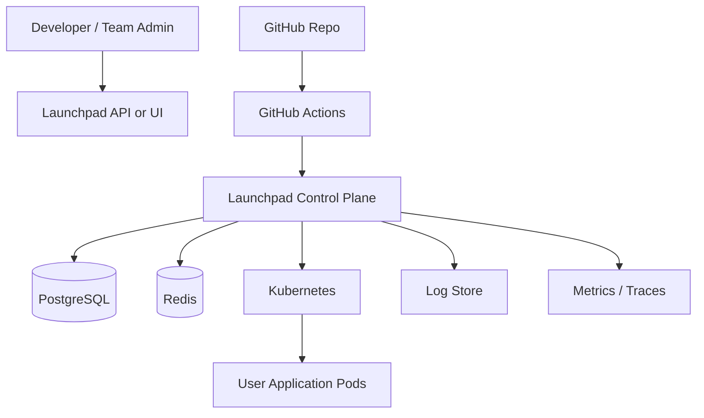
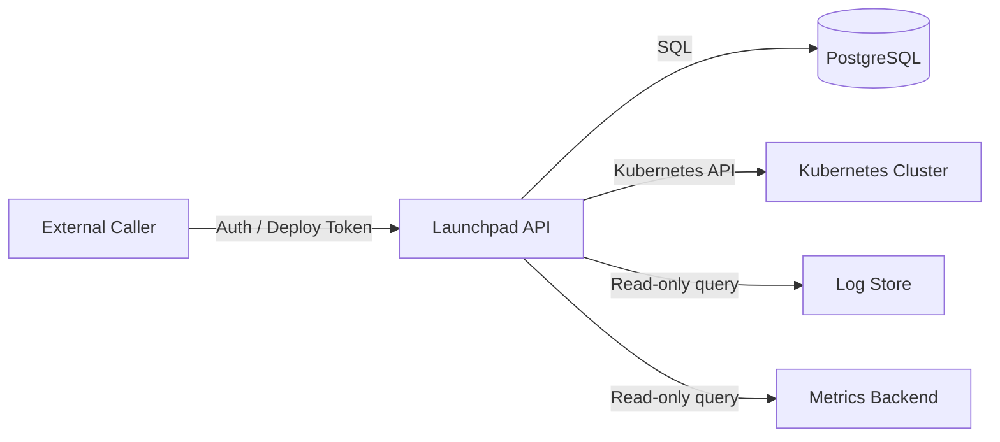

# System Context

## Overview

Launchpad is the control plane for application deployments. It sits between human operators or CI pipelines and the Kubernetes cluster that runs user workloads.

The system is intentionally narrow: it does not build source code, manage arbitrary infrastructure, or expose shell access into pods. Its job is to make deployment, rollback, and operational visibility reliable and auditable.

## Context Diagram

## External Actors

### Developer

Triggers deployments, checks rollout status, reads logs, and performs rollback when authorized.

### Team Admin

Manages project configuration, secrets, deploy tokens, and production release operations.

### GitHub Actions

Builds and pushes container images, then calls Launchpad with an immutable image reference and idempotency key.

### Kubernetes Cluster

Executes the workload released by Launchpad and returns rollout state, pod health, and service availability.

## System Responsibilities

Launchpad is responsible for:

- Authentication and role-based access control
- Project and environment metadata
- Encrypted secret storage
- Deployment orchestration
- Rollout reconciliation
- Runtime and log APIs
- Audit history
- Control plane observability

## Out of Scope

Launchpad does not own:

- Source compilation
- Multi-cluster scheduling
- Stateful application management
- Billing
- Interactive shell access to workloads

## Trust Boundaries

Security-sensitive operations stay inside the control plane. Kubernetes is treated as the runtime executor, not the source of business truth.

## Operational Assumptions

- The control plane can be deployed independently from user workloads.
- A single team can operate Launchpad locally with Docker Compose and a local Kubernetes cluster.
- Production deployments rely on immutable image tags or digests.
- Rollout status is reconciled from Kubernetes instead of trusting client input.
